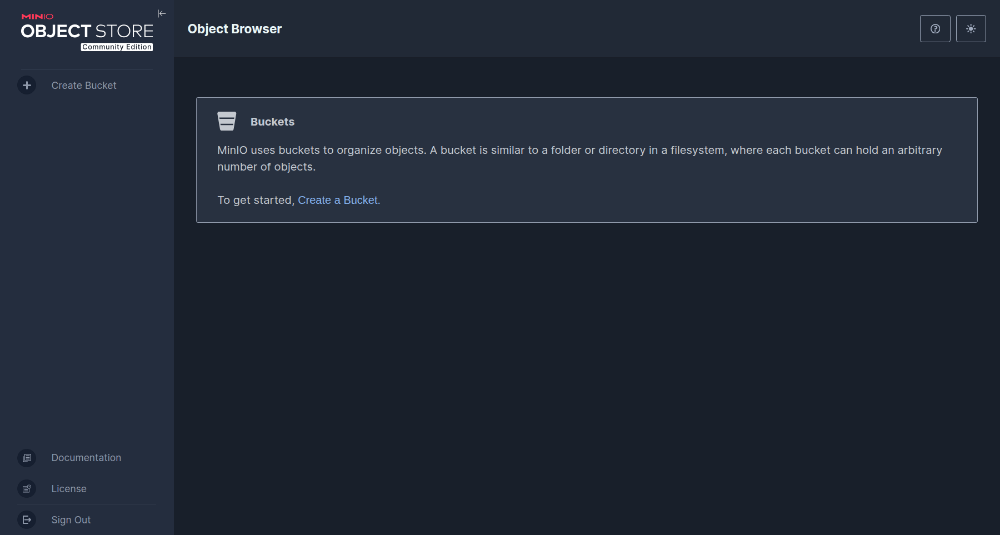
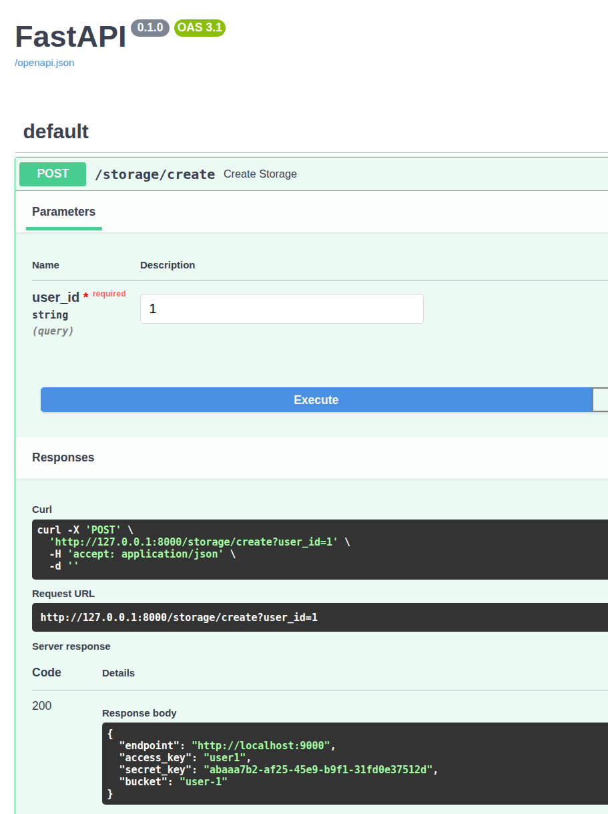
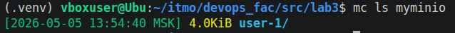
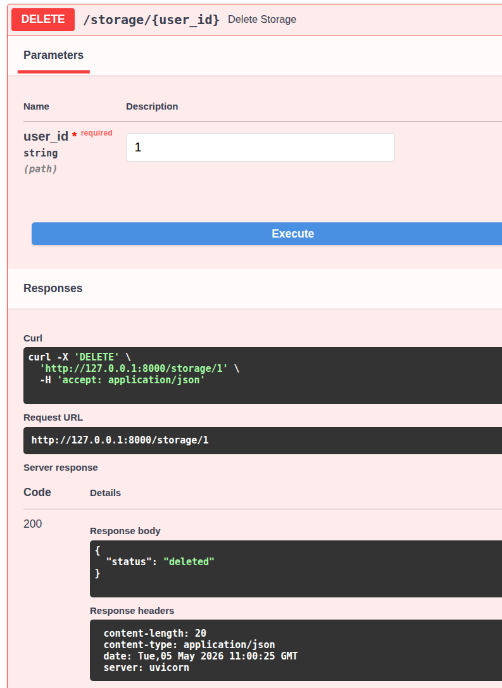
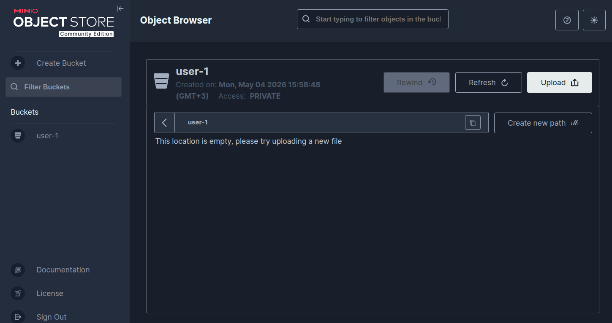
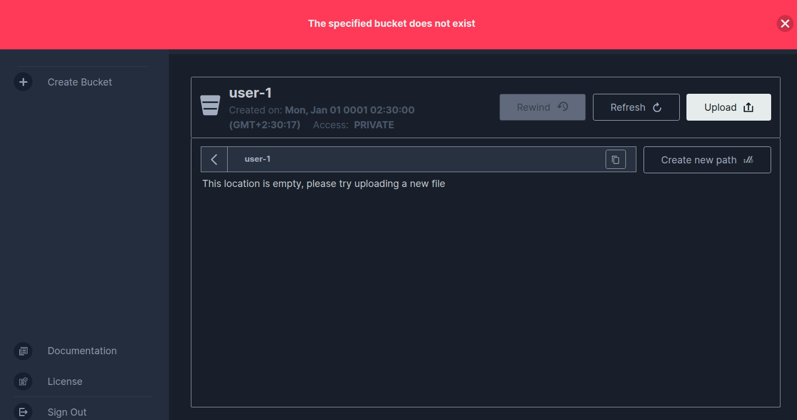

# Лабораторная работа №3 - Облако

## Часть 1 - Кодим

Для реализации моего великого замысла необходимо сначала выполнить основную часть. Я выбрал вариант "покодить".

Я установил Minio и Minio client, запустил minio server
```bash
minio server ~/minio-data --console-address ":9001"
```
API доступен по порту 9000, UI по 9001:


Также автоматически создан minioclient myminio

Для создания REST API я использовал python и библиотеку FastAPI. Полный код можно найти в этом [файле](main.py).
Хранилище создаётся POST запросом на `/storage/create`:
```py
@app.post("/storage/create")
def create_storage(user_id: str):
    access = f"user{user_id}"
    secret = str(uuid.uuid4())

    bucket = f"user-{user_id}"

    run(f"mc admin user add {MINIO_ALIAS} {access} {secret}")

    run(f"mc mb {MINIO_ALIAS}/{bucket}")

    policy = {
    "Version": "2012-10-17",
    "Statement": [
        {
          "Effect": "Allow",
          "Action": ["s3:*"],
          "Resource": [
              f"arn:aws:s3:::{bucket}",
              f"arn:aws:s3:::{bucket}/*"
          ]
        }
      ]
    }

    with open("policy.json", "w") as f:
        json.dump(policy, f, indent=2)

    run(f"mc admin policy add {MINIO_ALIAS} {access}-policy policy.json")
    run(f"mc admin policy set {MINIO_ALIAS} {access}-policy user={access}")

    return {
        "endpoint": "http://localhost:9000",
        "access_key": access,
        "secret_key": secret,
        "bucket": bucket
    }
```

Удаление производится DELETE запросом на `/storage/{user_id}`

```py
@app.delete("/storage/{user_id}")
def delete_storage(user_id: str):
    access = f"user{user_id}"
    bucket = f"user-{user_id}"

    run(f"mc rb --force {MINIO_ALIAS}/{bucket}")
    run(f"mc admin user remove {MINIO_ALIAS} {access}")

    return {"status": "deleted"}
```

Для проверки я использую SwaggerUI:


Как видно, хранилище успешно создано

Теперь удалю его


## Часть 2 - Играем

Вдохновителем этой части является [видео](https://youtu.be/-v5vCLLsqbA?si=g1taIShXhptHGWRJ), где PortalRunner создает билдер веб-страницы и веб-сервер в Portal 2. Для этого он используюет параметр запуска -netconport, который позволяет установить tcp-соединение с консолью на заданном порте. Затем он создаёт внутриигровые alias для взаимодействия с запросами и получает мини-сервер внутри игры.

В своем видео он показал, что можно даже передавать параметры сущностей внутри игры. Поэтому я решил связать жизненный цикл хранилища с кубом внутри игры.

Для этого нужно создать [**контроллер**](contoller/controller.py) и [**внутриигровой скрипт**](vscript/game_controller.nut). Так как я не умею писать скрипты для Portal 2, я просто дополнил его скрипт, использовав функцию для появления куба и отслеживая его уничтожение.

Контроллер создает хранилище и куб, а затем ждет, пока он не будет уничтожен. Как только куб уничтожается, он уничтожает и хранилище.

Запускаем контроллер:



Теперь я уничтожу куб:  
<video controls src="screenshots/0505(1).gif.mp4" title="Title"></video>

Вместе с ним уничтожается и хранилище:
