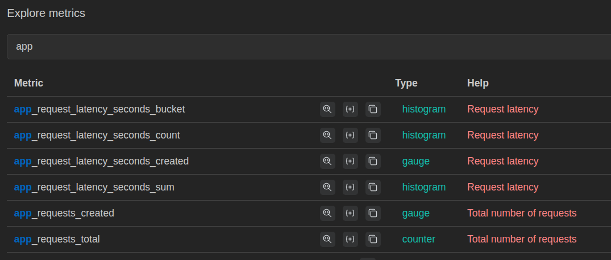
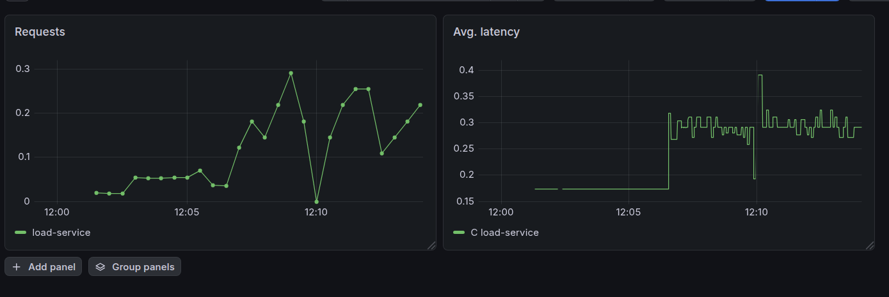
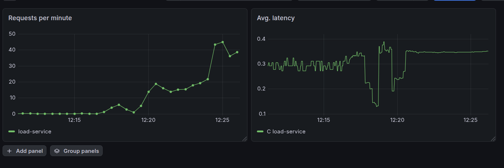

# Лабораторная работа №5 - Мониторинг

## Основная часть

Для сервиса я выбрал простой скрипт, имитирующий нагрузку

```py
from flask import Flask, jsonify
from prometheus_client import Counter, Histogram, generate_latest
import random
import time
import math


app = Flask(__name__)

REQUEST_COUNT = Counter(
    "app_requests_total",
    "Total number of requests"
)

REQUEST_LATENCY = Histogram(
    "app_request_latency_seconds",
    "Request latency"
)

@app.route("/")
def home():
    start = time.time()

    REQUEST_COUNT.inc()

    # Искусственная CPU-нагрузка
    value = 0
    for i in range(500000):
        value += math.sqrt(i)

    # Искусственная задержка
    delay = random.uniform(0.1, 0.5)
    time.sleep(delay)

    REQUEST_LATENCY.observe(time.time() - start)

    return jsonify({
        "status": "ok",
        "delay": delay
    })


@app.route("/health")
def health():
    return "healthy"


@app.route("/metrics")
def metrics():
    return generate_latest(), 200, {
        "Content-Type": "text/plain"
    }


if __name__ == "__main__":
    app.run(host="0.0.0.0", port=5000)
```

Он поставляет несколько метрик для Prometheus. Я запустил kube-prometheus-stack, применил `deployment.yaml`, `service.yaml`, `servicemonitor.yaml` и проверил через веб-интерфейс доступность метрик. Для доступа к внутренним эндпоинтам кластера я пробросил порты: 

```bash
kubectl port-forward svc/monitoring-kube-prometheus-prometheus 9090:9090
kubectl port-forward svc/load-service 8080:80
kubectl port-forward svc/monitoring-grafana 3000:80
```



По этим метрикам я составил 2 графика в Grafana

1. Запросы в минуту `rate(app_requests_total[1m])`
2. Средняя задержка `rate(app_request_latency_seconds_sum[1m]) / rate(app_request_latency_seconds_count[1m])`



Я запустил 
```sh
while true; do
    curl localhost:8080
done
```
чтобы эмулировать постоянную нагрузку.

